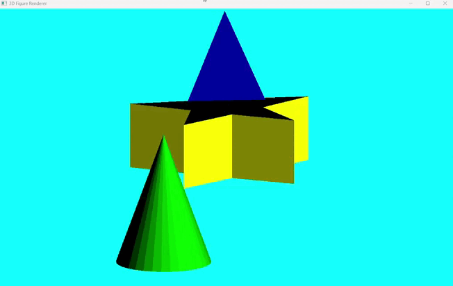

# 3D Figure Renderer

A simple 3D figure renderer built in Java using JavaFX. This project demonstrates how to load and render 3D models, handle transformations, and apply basic lighting effects.

## Features

- Load 3D models from OBJ files.
- Render basic shapes: pyramid, cone, and star.
- Apply transformations (rotation, projection).
- Basic lighting effects based on vertex normals.
- Interactive controls for rotation.

## Technologies

- Java
- JavaFX

### Class Descriptions

- **Figure**: Represents a 3D figure with its polygons and color.
- **FigureManager**: Manages the loading of figures from OBJ files.
- **FigureRenderer**: Handles the rendering of figures onto the canvas.
- **LightingHandler**: Calculates lighting intensities for the polygons.
- **Main**: The entry point of the application, sets up the scene and animation.
- **Matrix**: Provides matrix operations for transformations.
- **TransformationHandler**: Handles the setup and application of transformation matrices.
- **Vector**: Represents a 3D vector with basic vector operations.
- **Vertex**: Represents a vertex in 3D space with a position and normal vector.
- **ZBuffer**: Implements a Z-buffer for depth management during rendering.

## Demo

